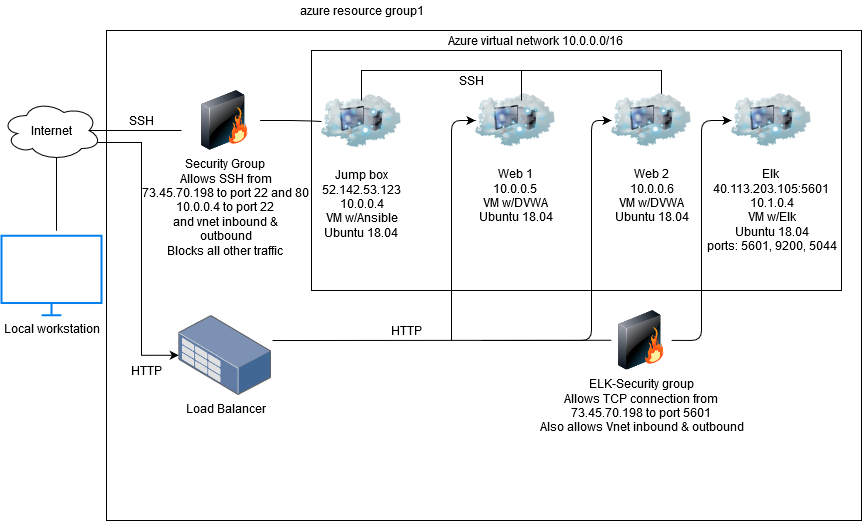

## Automated ELK Stack Deployment

The files in this repository were used to configure the network depicted below.

These files have been tested and used to generate a live ELK deployment on Azure. They can be used to either recreate the entire deployment pictured above. Alternatively, select portions of the install_elk.yml file may be used to install only certain pieces of it, such as Filebeat.

This document contains the following details:
- Description of the Topologu
- Access Policies
- ELK Configuration
  - Beats in Use
  - Machines Being Monitored
- How to Use the Ansible Build

### Description of the Topology

The main purpose of this network is to expose a load-balanced and monitored instance of DVWA, the D*mn Vulnerable Web Application.

Load balancing ensures that the application will be highly available, in addition to restricting ?network traffic? to the network.
- _TODO: What aspect of security do load balancers protect? What is the advantage of a jump box?_ Load balancers protect the availability of the network from potential DDOS attacks

Integrating an ELK server allows users to easily monitor the vulnerable VMs for changes to the system logs changes and system resource use.

The configuration details of each machine may be found below.
_Note: Use the [Markdown Table Generator](http://www.tablesgenerator.com/markdown_tables) to add/remove values from the table_.
| Name     | Function | Ip Address               | Operating system |
|----------|----------|--------------------------|------------------|
| Web 1    | Traffic  | 10.0.0.4                 | Ubuntu 18.04     |
| Web 2    | Traffic  | 10.0.0.5                 | Ubuntu 18.04     |
| Jump box | Gateway  | 52.142.53.123, 10.0.0.6  | Ubuntu 18.04     |
| ELK      | Monitor  | 40.113.203.105, 10.1.0.4 | Ubuntu 18.04     |

### Access Policies

The machines on the internal network are not exposed to the public Internet. 

Only the Jump Box machine can accept connections from the Internet. Access to this machine is only allowed from the following IP addresses:
  73.45.70.198  

Machines within the network can only be accessed by the Jump Box container at ip address 52.142.53.123  

A summary of the access policies in place can be found in the table below.
| Name     | Publicly Accessible | Allowed Ip Addresses             |
|----------|---------------------|----------------------------------|
| Jump Box | yes                 | 10.0.0.4, 10.0.0.5, 73.45.70.198 |
| Web 1    | no                  | 10.0.0.6, 10.0.0.5, 10.0.0.4     |
| Web 2    | no                  | 10.0.0.6, 10.0.0.5, 10.0.0.4     |

### Elk Configuration

Ansible was used to automate configuration of the ELK machine. No configuration was performed manually, which is advantageous because this allows for quick set up of machines after a playbook is created. 

The playbook implements the following tasks:
- Downloads docker.io
- Downloads python3
- Installs Docker
- Downloads docker container image sebp/elk:761 with ports 5601, 9200, and 5044 opened 
- Makes sure docker starts on restart

The following screenshot displays the result of running `docker ps` after successfully configuring the ELK instance.

### Target Machines & Beats
This ELK server is configured to monitor the following machines:
-Web1 10.0.0.5
-Web2 10.0.0.6

We have installed the following Beats on these machines:
Filebeat
Metricbeat

These Beats allow us to collect the following information from each machine:
- With Filebeat we can collect system log and web log files such as files downloaded from each country and Metricbeat allows us to monitor system metrics such as CPU usage

### Using the Playbook 
In order to use the playbook, you will need to have an Ansible control node already configured. Assuming you have such a control node provisioned: 

SSH into the control node and follow the steps below:
- Copy the install_elk.yml file to /etc/ansible/roles .
- Update the hosts file (/etc/ansible/hosts) to include groups for the [Elk] server VM ip address and the [webservers] VM's ip addresses. Then update the play book line hosts: to hosts: Elk
- Run the playbook, and navigate to http://40.113.203.105:5601 to check that the installation worked as expected.
